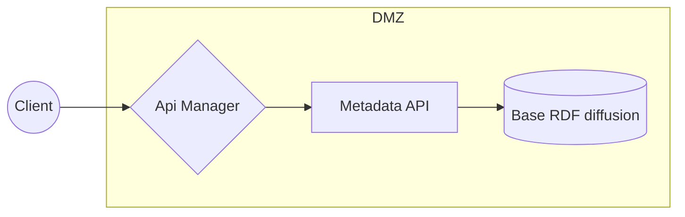
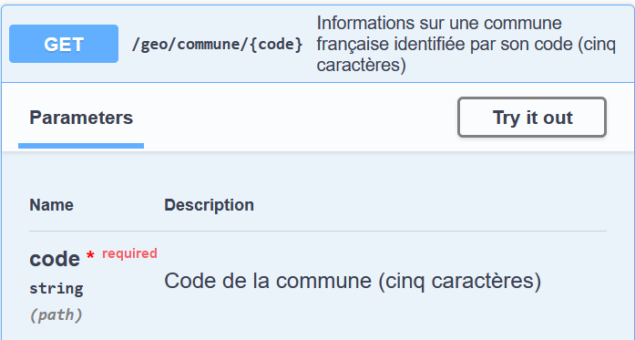
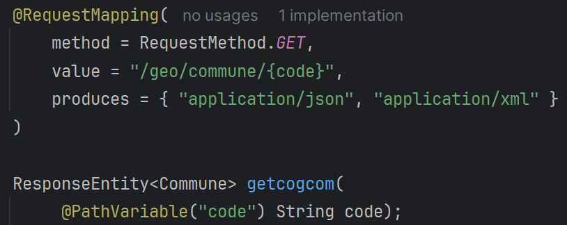
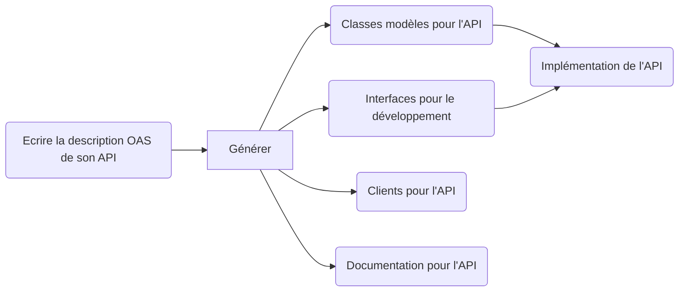
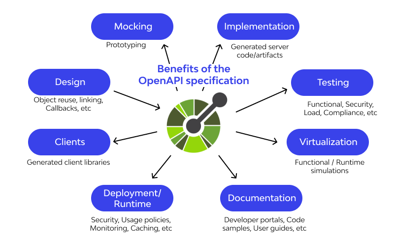
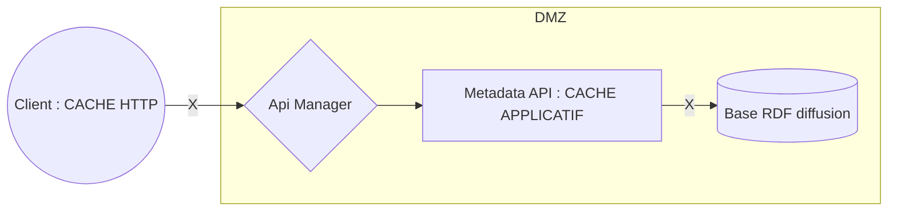

# Open API : une approche « _contrat first_ » sur metadata api

---

# API REST : arrêtons de jouer à cache - cache !
## Cas d'école avec _Metadata API_

<!--motivations : appliquer du cache dans des API REST consommées par des applications... -->

---

## Sommaire

1. Metadata API
2. Open API approche « _contrat first_ »
3. Les caches
4. Exemple de client 

---

## Metadata API

- Référentiel publique de métadonnées de l'Insee
  - Expose publiquement des métadonnées Insee
    - nomenclatures
    - concepts
    - COG
- https://api.insee.fr/metadonnees/swagger-ui/index.html

---

## Architecture de Metadata API



---

## Metadata API : la base RDF

- Démo : Exemples de base RDF
  - avec Accès direct possible (https://rdf.insee.fr/sparql/)
  - On préfèrera une sortie json : https://api.insee.fr/metadonnees/geo/region/27

---

## Metadata API : quelques irritants

- Librairies moins bien maîtrisées
- Beaucoup de répétitions dans le code
- Des méthodes de controleurs décorées comme des sapins de Noël
- Un fichier openAPI généré de + 8000 lignes à "maintenir"
- Lenteurs

---

## Metadata API : des avantages

- Pas de données confidentielles ni personnelles
- Que de la lecture
- Des données qui changent peu

---

## Metadata API : le candidat idéal

- Approche open api « _contrat first_ » 
- Des caches

---

## Open API approche « _contrat first_ »

- [Open API](https://github.com/OAI/OpenAPI-Specification) :
  - Spécification pour un standard de description des API http (API REST)
  - https://openapi-map.apihandyman.io/
  - [Example de description](https://editor-next.swagger.io/)

---

## Open API approche « _contrat first_ »

- Approche  « _contrat first_ » ?
- Une question : qui vient en premier ?

| OAS                        | Code                    |
|----------------------------|-------------------------|
|  |  |

---

## Open API approche « _contrat first_ »

- Traditionnellement : code => spécification OAS
- C'est l'approche _code first_

---

## Open API approche « _contrat first_ »



---

## Open API approche « _contrat first_ »



<!--
- argumentaire approche contract first
- argumentaire bis : code client toujours à jour et générable facilement (automatisation avec renovate)
-->

---

## Open API approche « _contrat first_ »

- Plétore d'outils :
  - Référentiel d'outils : https://tools.openapis.org/
  - Editeur : https://github.com/OpenAPITools
  - Editeur : https://swagger.io/tools/
  - ...

---

## Open API approche « _contrat first_ »

- Un module pour la description de l'API :
  - Edition dans l'IDE (plugins)
<!-- ultimate ou Zalando-->
  - Editeur swagger en ligne

<!-- Montrer la spec metadata-->

---

## Open API approche « _contrat first_ »

- Générations : [OpenApi Generator](https://openapi-generator.tech/)
  - [plugin maven `org.openapitools:openapi-generator-maven-plugin`](https://github.com/OpenAPITools/openapi-generator/blob/master/modules/openapi-generator-maven-plugin/README.md)
  - Un module pour le modèle (`Commune`, `Departement`) : metadata-modelapi (réutilisable)
  - Un module pour les interface api : metadata-interfaceapi
  - Un module pour les interface client : metadata-clientinterface avec [open feign](https://spring.io/projects/spring-cloud-openfeign#overview)

---

## Open API approche « _contrat first_ »

- Implémentation de l'API

---

## Les caches



---

## Cache http

- En-tête http : `< Cache-Control: max-age=108000, must-revalidate`
- Ca ne voit pas !

---

## Cache http

- Dans la spécification OAS !
- La durée du cache est une spécification !

---

## Cache http

- Le standard ne prévoit rien pour le cache => utiliser une extension

---

## Cache http

- Comment utiliser l'extension  ?
  - [Aimez vous les mustaches](https://github.com/OpenAPITools/openapi-generator/blob/v7.5.0/modules/openapi-generator/src/main/resources/JavaSpring/api.mustache#L250)
- Plus moche mais efficace [`x-operation-extra-annotation`](https://openapi-generator.tech/docs/generators/spring/#supported-vendor-extensions)

---

## Cache http

- Comment générer les en-têtes Cache-Control côté serveur :
  - "décorer" les méthodes de contrôleur lorsque l'annotation @HttpCache est présente
  - Spring AOP

---

## Cache applicatif

- 💡Utiliser l'annotation `@HttpCache` lorsqu'elle est présente sur un endpoint
  - Décorer les méthodes des endpoints concernées (déjà "filtrées" pour le cache http)
  - Un cache commun à tous les endpoints
  - clé = (`Method`, `Parameters[]`)

---

## Cache applicatif

- Appliquer :
```java
var key=new CacheKeyPair(invocation.getMethod(),
                   invocation.getArguments());
var response = cache.get(key);
if (response == null){
    response = invocation.proceed();
    cache.put(key, response);
}
return response;
```

---

## Cache applicatif

- Problème : la révocation de la donnée dans le cache doit correspondre à la durée définie dans `@HttpCache`
- => la durée de conservation est portée par la clé (`key.getDuration()`)
- => Redéfinir javax.cache.expiry.ExpiryPolicy
  - exemple ici dans le cas de EhCache : https://github.com/FBibonne/openapi-cache/blob/master/metadata-webimpl/src/main/java/fr/insee/oascache/metadata/cachedecorator/CacheAOPConfig.java#L66

---

## Le client

- Import du modèle et des interfaces client
- Implémentation des interfaces
  - Laisser faire spring open-feign

<!--HATEOS,  possibilité d'élargir le client généré avec du retry -->

---

## Le client

- Utiliser [OkHttp](https://square.github.io/okhttp/)
  - Respecte automatiquement les instructions de cache http

---

## Conclusion

- Décrire son contrat au format OAS avant de développer
- Partager des librairies générées (modèles et interfaces) avec ses clients (mise à jour automatique)
- Activer les caches ! 
  - http dès que possible
  - applicatif
- Utiliser OKHttp
- Aller plus loin : 
  - ajouter des en-tête etag et activer un filtre pour éviter de retransférer sur le réseau les données sans cache

---

## Plus de Liens

- Le code : https://github.com/FBibonne/openapi-cache
- https://www.baeldung.com/spring-boot-openapi-generator-custom-templates#customization_scenario
- https://medium.com/devexperts/specification-first-make-life-easier-with-openapi-and-spring-eeaf5c22146b
- https://square.github.io/okhttp/changelogs/changelog_4x/#version-450-rc1 -> okhttp négocie par défaut la compression web
- Documentation openapi-generator :
  - https://github.com/OpenAPITools/openapi-generator/tree/master/modules/openapi-generator-maven-plugin
  - [Client java](https://openapi-generator.tech/docs/generators/java)
  - [Global properties](https://openapi-generator.tech/docs/globals/)

